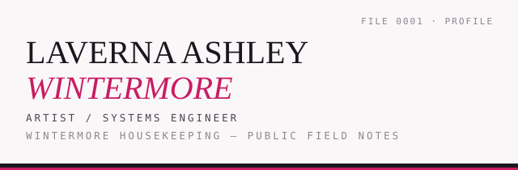

<picture>
  <source media="(prefers-color-scheme: dark)" srcset=".github/assets/wintermore-masthead-dark.svg">
  <source media="(prefers-color-scheme: light)" srcset=".github/assets/wintermore-masthead-light.svg">
  
</picture>

`ACTIVE RESEARCH · GREMLIN` · `ENGINEERING · KITSUNEFOX` · `UNPUBLISHED · WINTERMORE`

Artist and systems engineer. Wintermore Housekeeping.

[GitHub](https://github.com/nutypebuddha) · [Codeberg](https://codeberg.org/NutypeBuddha) · [Rust](https://github.com/nutypebuddha/kitsunefox)

---

## 01 — Now

[**GREMLIN**](https://github.com/nutypebuddha/GREMLIN) —
primary public research project: minimal session structure, provenance,
refusal, and the boundary between capability and authority.

Art + [**kitsunefox**](https://github.com/nutypebuddha/kitsunefox) —
my maintained fork of
[0x251C08/kitsunefox](https://github.com/0x251C08/kitsunefox),
with hardened Firefox configuration, themes, reproducible release tooling,
checksums, verification, launcher, and install discipline.

## 02 — Wintermore

Local systems work, unpublished. No repository link yet — it does not exist
publicly. A local-first Agent and workspace system built around persistent
identity, provider separation, explicit human authorization, provenance, and
offline operation.

## 03 — Research

Prior verification research, now historical unless separately made public
later. Earlier systems (L.ai and predecessors) are archived; their source,
releases, tests, and history are preserved for reference.

## 04 — Historical

- **L.ai verification systems** — archived.
  ([L](https://github.com/nutypebuddha/L),
  [lai](https://github.com/nutypebuddha/lai),
  [Laverna](https://github.com/nutypebuddha/Laverna),
  [cid](https://github.com/nutypebuddha/cid),
  [cid-bridge](https://github.com/nutypebuddha/cid-bridge)).
- **mana-core-v2** — archived semantic simulation experiment.
- **Other archived experiments and placeholders** —
  [Mirror-Sword](https://github.com/nutypebuddha/Mirror-Sword),
  [RuneCore-](https://github.com/nutypebuddha/RuneCore-),
  and [Zanpakato-Kasien](https://github.com/nutypebuddha/Zanpakato-Kasien).

---

## 05 — Receipts

Selected results from local, unpublished Wintermore work. Wintermore remains
unpublished until it is ready.

Earned results from completed work, stated plainly:

- Agent identity survives process restart and provider removal.
- The exact same portable behavior contract reaches the selected intelligence
  slot, verified byte-for-byte.
- Real local-model runs are measured per case, including failures — no
  cherry-picking.
- Local repository changes require explicit human confirmation; stale proposals
  are refused automatically.
- Remote repository context is read with zero remote mutation capability.

---

## 06 — How I build

- Deterministic hosts over hopeful prompts.
- Explicit human authorization before any mutation.
- Fail loud instead of fabricating confidence.
- Provenance and receipts over claims.
- Smallest experiment that can falsify the current idea.

---

## 07 — Stack

| Layer | Tools |
|---|---|
| **Systems** | Rust, SQLite, Git |
| **AI** | Ollama, local LLMs |
| **UI** | Tauri |
| **Portability** | Offline-first |

---

*Verify, don't trust.*

